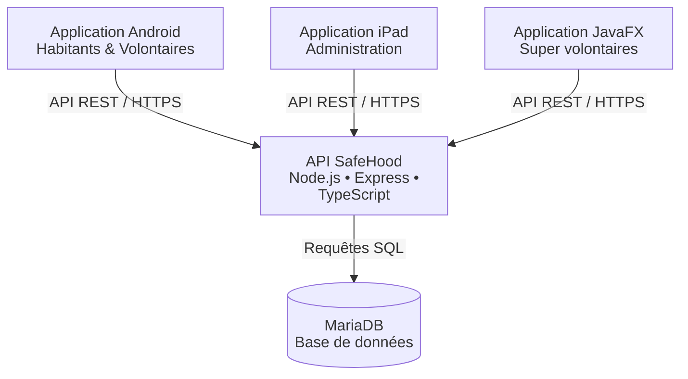

# SafeHood

Plateforme multiplateforme de gestion et de suivi des alertes de quartier, développée dans le cadre du projet annuel de l’ESGI.

## Présentation du projet

L’objectif du projet est de permettre aux habitants de signaler rapidement une situation nécessitant une intervention, puis d’assurer son traitement par les différents acteurs de la plateforme.

SafeHood repose sur plusieurs applications complémentaires qui communiquent avec une API centrale. Les habitants peuvent créer et suivre des alertes depuis l’application Android, tandis que les outils d’administration permettent de superviser les utilisateurs, les volontaires, les quartiers et les interventions.

La plateforme intègre notamment la gestion des comptes utilisateurs, l’authentification sécurisée, les rôles et autorisations, la création et le suivi des alertes, l’affectation des volontaires ainsi que la rédaction de rapports d’intervention.

Le projet a été développé collectivement afin de proposer une solution complète, cohérente et utilisable sur plusieurs supports.

## Les quatre applications

SafeHood est composé de quatre applications complémentaires, toutes reliées à une API centrale.

### API SafeHood

L’API constitue le cœur du système. Elle centralise les données, applique les règles métier et permet aux différentes applications de communiquer avec la base de données.

Elle prend notamment en charge :

- l’authentification des utilisateurs ;
- la gestion des rôles et des autorisations ;
- la gestion des quartiers ;
- la création et le suivi des alertes ;
- l’affectation des volontaires ;
- la gestion des interventions et des rapports ;
- l’administration des utilisateurs.

### Application Android

L’application Android est destinée aux habitants et aux volontaires.

Pour les habitants, elle permet notamment de :

- créer un compte et se connecter ;
- consulter et modifier leurs informations personnelles ;
- signaler une alerte dans leur quartier ;
- consulter les alertes existantes ;
- suivre l’état d’une alerte ;
- accéder aux informations utiles liées à leur quartier.

Les habitants disposant du rôle de volontaire peuvent également :

- consulter les alertes qui leur sont proposées ;
- accepter ou refuser une intervention ;
- consulter les alertes qui leur sont affectées ;
- renseigner un rapport d’intervention après le traitement d’une alerte ;
- signaler la fin d’une intervention.

### Application iPad

L’application iPad est destinée à la supervision et à l’administration de la plateforme.

Elle permet notamment de :

- consulter les utilisateurs ;
- créer, modifier ou supprimer des comptes ;
- gérer les rôles ;
- consulter les quartiers ;
- superviser les alertes et les interventions ;
- suivre l’activité générale de la plateforme.

### Application JavaFX

L’application JavaFX est un client lourd réservé aux habitants disposant du rôle de super volontaire.

Chaque super volontaire est chargé de la gestion des volontaires de son quartier.

L’application lui permet notamment de :

- se connecter avec un compte autorisé ;
- consulter les volontaires de son quartier ;
- créer et gérer les comptes des volontaires ;
- consulter les alertes liées à son quartier ;
- affecter ou proposer une alerte à un volontaire ;
- suivre l’avancement des interventions ;
- consulter les rapports d’intervention ;
- superviser l’activité des volontaires de son quartier.

## Technologies utilisées

Le projet SafeHood repose sur plusieurs technologies adaptées aux différentes applications de la plateforme.

### API

- Node.js
- TypeScript
- Express
- MariaDB
- Docker
- JWT pour l’authentification
- Argon2 pour la sécurisation des mots de passe
- pnpm pour la gestion des dépendances

### Application Android

- Kotlin
- Android SDK
- Android Studio
- Communication avec l’API REST

### Application iPad

- Swift
- SwiftUI
- Xcode
- Communication avec l’API REST

### Application JavaFX

- Java
- JavaFX
- Communication avec l’API REST

### Infrastructure et outils

- Git
- GitHub
- Docker
- Nginx
- PM2
- VPS Ubuntu
- HTTPS

## Architecture générale

SafeHood repose sur une architecture centralisée autour d’une API REST.

Les différentes applications clientes communiquent avec l’API afin d’accéder aux données et aux fonctionnalités de la plateforme.

L’architecture générale est organisée de la manière suivante :

- l’application Android est utilisée par les habitants et les volontaires ;
- l’application iPad est utilisée pour l’administration et la supervision générale ;
- l’application JavaFX est utilisée par les super volontaires pour gérer les volontaires de leur quartier ;
- l’API centralise la logique métier, l’authentification, les autorisations et les échanges avec la base de données ;
- MariaDB assure le stockage persistant des données.

Les applications clientes ne communiquent pas directement avec la base de données. Elles passent toutes par l’API SafeHood, ce qui permet de centraliser les règles métier et de sécuriser l’accès aux données.

### Schéma d’architecture

